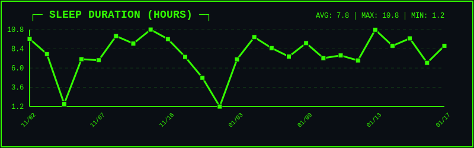
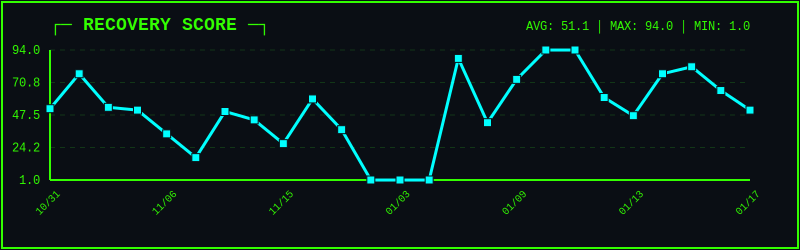
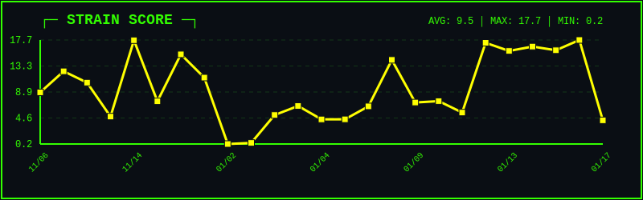
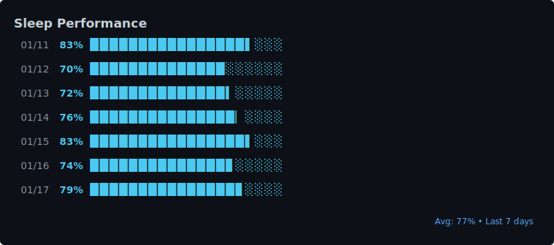

# Whoop Data Tracker

Automated pipeline to fetch Whoop health data and generate visualizations for GitHub.

## Visualizations

### Sleep Duration


### Recovery Score


### Strain Score


### Sleep Performance


## Setup

### 1. Install Dependencies

```bash
pip install -r requirements.txt
```

### 2. Authenticate with Whoop

Run the authentication script to get your access tokens:

```bash
python whoop_auth.py
```

This will:
- Open your browser to authenticate with Whoop
- Start a local server to receive the OAuth callback
- Save your access and refresh tokens to `tokens.json`

### 3. Fetch Your Data

```bash
python whoop_data.py
```

This fetches the last 30 days of:
- Sleep data
- Recovery scores
- Strain/cycle data
- Workout data
- User profile

Data is saved to the `data/` directory as JSON files.

### 4. Generate Visualizations

```bash
python generate_viz.py
```

This creates SVG graphs:
- `sleep_duration.svg` - Hours of sleep per night
- `recovery_score.svg` - Daily recovery scores
- `strain_score.svg` - Daily strain scores
- `sleep_performance.svg` - Sleep quality percentage

## GitHub Actions Automation

To automatically update your data daily:

### 1. Initialize Git Repository

```bash
git init
git add .
git commit -m "Initial commit"
git branch -M main
git remote add origin <your-repo-url>
git push -u origin main
```

### 2. Add GitHub Secrets

Go to your repository Settings > Secrets and variables > Actions, and add:

- `WHOOP_CLIENT_ID`: Your Whoop app client ID
- `WHOOP_CLIENT_SECRET`: Your Whoop app client secret
- `WHOOP_REFRESH_TOKEN`: Copy from `tokens.json` after running `whoop_auth.py`

### 3. Enable GitHub Actions

The workflow `.github/workflows/update_whoop_data.yml` will:
- Run daily at 9 AM UTC
- Fetch fresh data from Whoop
- Generate updated visualizations
- Commit and push changes

You can also trigger it manually from the Actions tab.

## Project Structure

```
.
├── whoop_auth.py          # OAuth authentication flow
├── whoop_data.py          # Data fetching script
├── generate_viz.py        # Visualization generator
├── data/                  # JSON data files (gitignored)
├── *.svg                  # Generated visualizations
├── .env                   # Environment variables (gitignored)
├── tokens.json            # OAuth tokens (gitignored)
└── .github/workflows/     # GitHub Actions automation
```

## API Rate Limits

- 10,000 requests per day
- 100 requests per minute

## Data Sources

All data is fetched from the official [Whoop API v1](https://developer.whoop.com/api/).

---

**Last updated:** Auto-updated daily via GitHub Actions
